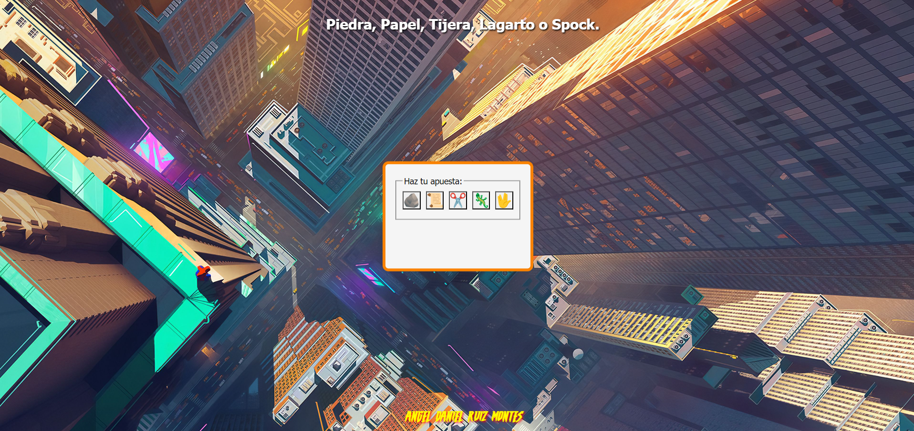
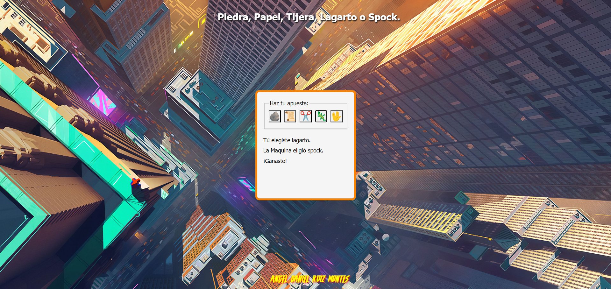

# piedra-papel-tijera-lagarto-spock

Esta es una aplicación que simula el clásico juego de “piedra, papel y tijera” con la incorporación de “lagarto” y “Spock”  como en la famosa serie “The Big Bang Theory”, Realizada en JavaSript y estilos con CSS.
 
## Contenidos
 
1. [Capturas de pantalla](#capturas-de-pantalla)
2. [Tecnologías utilizadas](#tecnologías-utilizadas)
3. [Créditos](#créditos)
 
## Capturas de pantalla
Inicio del Juego.

El jugador elige "Lagarto" y gana la partida.

EL jugador elige "tijera" y empata la partida.

El jugador elige "piedra" y pierde la partida.

 
 
## Tecnologías utilizadas
 
- JavaScript
- HTLM
- CSS

 
## Créditos
 
Este proyecto fue desarrollado por [Ángel Daniel](https://github.com/AngelDanielRuizMontes/).
